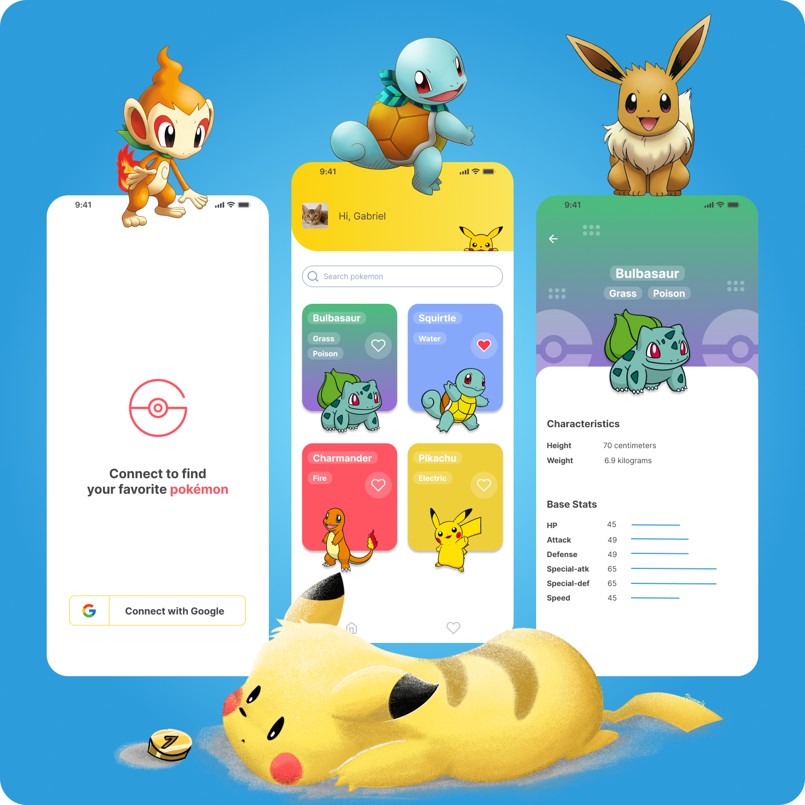

<div align="center">

## Pokedex


</div>

##



## 💡 Purpose

This app was made to serve as a portfolio to illustrate my skills and quality of my work. I hope you enjoy it !

## 💻 Project

Pokedex is a pokémon app where you can find your favorite pokémon and see it's stats.

## 🛠️ Features

- [ ] Users can sign in with Google Account;
- [ ] Users can log out;
- [ ] Users can mark the pokémon as favorite ones;
- [ ] Users can search pokémon by it's name;
- [ ] The favorite pokémon are stored on Firestore Cloud;

## ✨ Technologies

- [ ] Flutter
- [ ] Provider
- [ ] Pokeapi API
- [ ] Firebase Social Authentication with Google
- [ ] Cloud Firestore
- [ ] Google fonts
- [ ] Lottie

## 🖍️ Layout

Pokedex layout is available on Figma. You can access [through this link](https://www.figma.com/file/6xBNlkjCWyDcztGqDD883C/Pokedex?node-id=0%3A1).

## 🚩 Getting Started

In case if you don't have your development environment setting up, check this [Flutter Documentation](https://flutter.dev/docs/get-started/install) to learn how to do so.

Clone this project repository

```
git clone git@github.com:gsaaraujo/pokedex.git
```

Type **flutter pub get** to install all dependencies.

After, run:

```
flutter run --release

```

Before running the app, you need to register the app and set your own credentials on [Firebase Console ](https://firebase.google.com/).

This app works for Android only.
